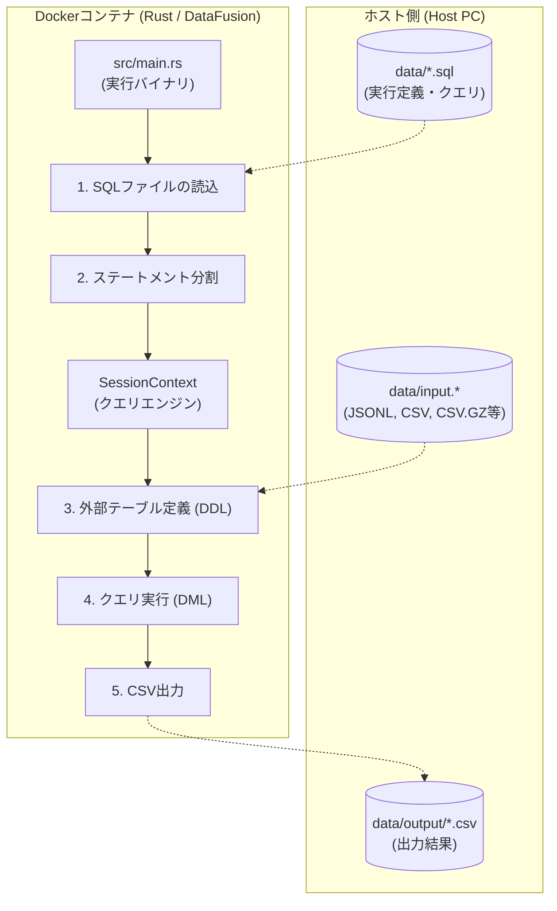

# データ処理ロジックの解説

本プロジェクト `DataFusion SQL Processor` では、Apache DataFusion を活用して、外部 SQL ファイルに記述された定義に基づいて多様な形式のデータを処理し、CSV 形式で出力します。

## 処理フロー図

## 各ステップの機能詳細

### 1. SQLファイルの読込と出力先指定
コマンドライン引数で SQL ファイルのパス（必須）と、出力先のベースディレクトリ（任意、デフォルトは `data`）を指定します。
- プログラムを再ビルドすることなく、処理対象のファイルや抽出条件、結果の書き出し先を自由に変更できます。

### 2. テーブルの外部定義 (DDL)
SQL ファイル内の `CREATE EXTERNAL TABLE` 文を実行することで、実行時に動的にデータソースを登録します。

- **多様なフォーマット**: `STORED AS JSON` (JSONL) や `STORED AS CSV` をサポート。
- **圧縮サポート**: `OPTIONS (format.compression gzip)` を指定することで、`.gz` 圧縮ファイルを解凍せずに直接読み込めます。
- **スキーマの明示**: カラム名と型（`VARCHAR` 等）を明示することで、型推論による意図しない変換（例: 先頭の「0」が消える数値変換）を防止できます。

### 3. マルチ・ステートメント実行
`src/main.rs` は、SQL ファイルの内容をセミコロン（`;`）で分割し、順番に実行します。
1. `CREATE EXTERNAL TABLE` でテーブルを定義。
2. そのテーブルに対して `SELECT` 命令を実行。
という流れを一つの SQL ファイルで記述可能です。

### 4. カラムナ処理と最適化
DataFusion は Apache Arrow フォーマットを基礎としたカラムナ（列指向）エンジンです。
- 必要な列のみをメモリに展開するため、巨大なデータに対しても高速にフィルタリングや集計が行えます。

### 5. CSV形式での書き出し
クエリの最終結果（`DataFrame`）を、指定されたベースディレクトリ配下の `output/` フォルダに書き出します（デフォルト：`data/output/`）。
- DataFusion の特性上、内部的にパーティション分割された複数の `.csv` ファイルとして生成される場合があります。

## まとめ

このツールは **「データ定義」も「クエリロジック」もすべて外部 SQL ファイルに集約** しているのが最大の特徴です。
Rust コードを知らなくても、SQL の知識だけで「入力ファイルの変更」「圧縮への対応」「型の制御」「複雑な分析」が完結する柔軟なデータ処理基盤を提供します。
