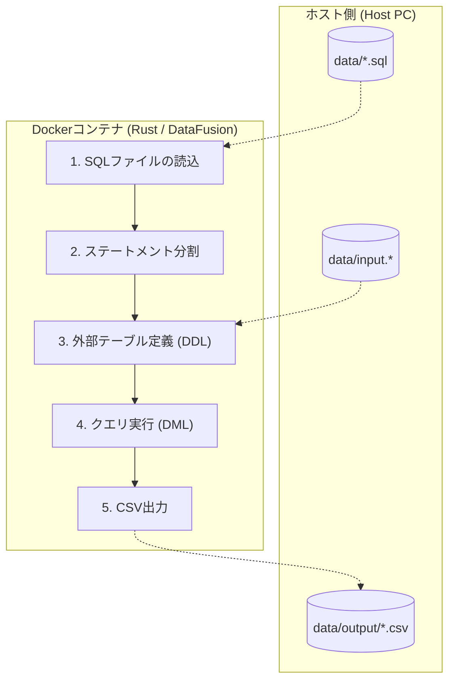

<!-- _class: title-slide -->

# DataFusion SQL Processor
### SQLベースの柔軟なデータ処理基盤

---

<!-- _class: section-title -->

# 1. プロジェクト概要 & アーキテクチャ

---

## DataFusion SQL Processor とは

Apache DataFusion を活用して、外部 SQL ファイルに記述された定義に基づいてデータを処理し、多様な形式で出力する Rust 製ツールです。

- **SQL 完結型**: データ定義（DDL）もクエリロジックもすべて外部 SQL に集約。
- **柔軟な対応**: JSONL, CSV, 圧縮ファイル (.gz) 等をコード変更なしで処理可能。
- **高速処理**: Apache Arrow 準拠のカラムナエンジンによる最適化。

---

## 処理フロー



---

<!-- _class: section-title -->

# 2. コア機能と処理ロジック

---

## 外部テーブル定義 (DDL)

SQL ファイル内の `CREATE EXTERNAL TABLE` 文により、実行時に動的にデータソースを登録します。

- **多様なフォーマット**: `STORED AS JSON` (JSONL), `STORED AS CSV` をサポート。
- **圧縮サポート**: `OPTIONS (format.compression gzip)` で `.gz` を直接読込。
- **スキーマ明示**: カラム名と型を明示し、意図しない型変換を防止。 <span class="badge badge-yellow">TIP</span>

---

## マルチ・ステートメント実行

SQL ファイルの内容をセミコロン（`;`）で分割し、順番に実行します。

1. **定義**: `CREATE EXTERNAL TABLE` で入力ファイルを定義。
2. **加工**: 定義したテーブルに対して `SELECT` 命令を実行。

一つの SQL ファイルで「入力定義から抽出ロジックまで」を完結できます。

---

## カラムナ処理と最適化

DataFusion (Apache Arrow) による列指向処理のメリット：

- **メモリ効率**: 必要な列のみを読み込むため、巨大なデータも高速に処理。
- **フィルタリング最適化**: クエリ実行計画の最適化により、不要なデータ読み込みを最小化。

---

<!-- _class: section-title -->

# 3. 使い方と実行手順

---

## コンテナでのビルドと実行

`rust_dev` フォルダの Docker 環境を使用します。

```bash
# コンテナ起動
cd rust_dev && docker compose up -d --build

# コンテナ内での実行 (基本的な例)
cargo run -- data/query.sql

# 出力先とフォーマットを指定する場合
cargo run -- data/query.sql --output-dir ./my_output --format parquet
```

---

## 一括処理 (Batch Processing)

ディレクトリ内の複数ファイルを一括処理するスクリプトを提供。

- **自動置換**: SQL 内の `LOCATION` 句を各ファイルのパスに自動書き換え。
- **対応形式**: JSONL, CSV, CSV.GZ 用のスクリプトを完結。

```bash
# 例: Linux で CSV.GZ を一括処理
./process_csv_gz.sh data data/query_csv_gz.sql csv
```

---

<!-- _class: section-title -->

# 4. ビルドとデプロイ

---

## クロスコンパイル

Docker コンテナ内で異なるターゲット向けのバイナリを生成可能です。

- **Linux 用**: `cargo build --release`
- **Windows 用**: `cargo-zigbuild` を使用

```bash
# Windows x86_64 用のビルド例
cargo zigbuild --target x86_64-pc-windows-gnu --release
```

---

<!-- _class: section-title -->

# 5. まとめ

---

## まとめ

DataFusion SQL Processor は、**「データ定義」も「クエリロジック」もすべて SQL に集約** することで、高い柔軟性とパフォーマンスを両立しています。

- Rust のコードを知らなくても SQL 知識だけで複雑な分析が可能。
- 型制御や圧縮対応など、実務で必要な機能が SQL 経由で利用可能。
- Docker 環境により、開発からデプロイまでがスムーズに完結。

---

<!-- _class: section-title -->

# Appendix（付録）

---

## コマンドライン引数詳細

| 引数 | 説明 | 備考 |
| :--- | :--- | :--- |
| `sql_file_path` | 実行する SQL ファイルのパス | **必須** |
| `-f, --format` | 出力形式 (`csv`, `parquet`, `jsonl`) | デフォルト: `csv` |
| `-o, --output-dir` | 出力先ディレクトリ | デフォルト: `output/` |

---

## トラブルシューティング：権限エラー

ホスト側の UID/GID が一致しない場合は、ビルド引数で指定可能です。

```bash
docker compose build --build-arg UID=$(id -u) --build-arg GID=$(id -g)
```
